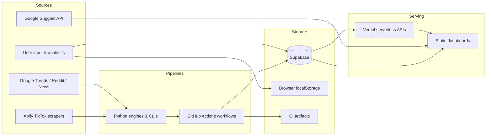

# Patriot Radar / Creator Radar

Patriot Radar (also branded **Creator Radar**) is a content intelligence platform for patriotic and niche-focused creators. It collects trend signals from TikTok, Google Trends, Reddit, and related sources; stores structured intelligence in a managed database; and serves it through static web dashboards with serverless API endpoints.

The system is designed around **signal ingestion → transformation → storage → presentation**, with role-based access control, commerce-aware feature gating, and fail-safe defaults when upstream services are unavailable.

---

## Table of Contents

- [Architecture Overview](#architecture-overview)
- [Features](#features)
- [Tech Stack](#tech-stack)
- [Integrations](#integrations)
- [Security Design](#security-design)
- [Repository Layout](#repository-layout)
- [Scheduled Pipelines](#scheduled-pipelines)
- [Data Model](#data-model)

---

## Architecture Overview

The platform spans three deployment surfaces that work together:

| Layer | Responsibility | Primary location |
|-------|----------------|------------------|
| **Data pipelines** | Scheduled scraping, extraction, scoring, and persistence | Python scripts + GitHub Actions |
| **API layer** | Auth-aware aggregation, RBAC filtering, AI proxying | Vercel serverless functions (`api/`) |
| **Presentation** | Dashboards, client-side intelligence, local caching | Static HTML + JavaScript |

### High-level data flow



### Dual dashboard model

1. **Creator Radar** (`dashboard-sync/`) — The primary production UI. Includes authentication, niche-based trend scanning, TikTok intelligence feeds, comment virality analysis, commerce/inventory panels, AI chat, performance logging, and admin tooling.

2. **Patriot Radar** (`index.html`) — A lighter mobile-oriented dashboard focused on Supabase authentication and the TikTok trend intelligence feed.

A separate external dashboard repository receives synced assets and trend scan artifacts from CI, enabling a split deployment between pipeline code and public-facing site content.

### Live State API

The `/api/tiktok-live-state` endpoint is the unified orchestration contract for dashboard modules. It:

- Validates the caller via Supabase JWT (Bearer token).
- Assembles trends, products, content queue, approvals, performance, and system health from database tables.
- Applies role-based access control before returning JSON.
- Returns a stable empty contract on failure (HTTP 200 with degraded/empty modules) rather than exposing internal errors.

A parallel Python assembler exists for local development and testing; production uses the Node.js implementation.

---

## Features

### Trend intelligence

- **TikTok trend scan** — Apify-based video collection, signal extraction (hooks, formats, emotions, topics, keyword clusters, virality scores), and persistence to a trend intelligence feed table.
- **Patriotic trends scanner** — Google Trends, Reddit, Twitter/X, news, and autocomplete aggregation on a recurring schedule; results published as JSON artifacts.
- **Niche trend scanning** — Client-side Google Suggest queries scored heuristically for the Plan tab (daily plan, primary target, intelligence feed).
- **Trend shift detection** — Engine for identifying emerging shifts from scraped TikTok content.

### Comment & virality intelligence

- **Niche comment ingest** — Isolated Apify comment scraping into a raw comment store.
- **Niche comment signals** — Signal processing and virality prediction computed at query time in the browser from raw comment data.
- **Virality learning pipeline** — Snapshots, calibration logs, and explanations written by backend learning engines; surfaced in dashboard extension panels.

### Commerce & inventory (feature-gated)

- **TikTok Shop content pipeline** — Predictive inventory layer, content mode resolution, and reactive inventory gate for product attachment (CLI-driven; commerce modules gated by feature flags).
- **Client-side inventory predictor** — Matches trend keywords against a locally cached shop catalog and surfaces inventory gap cards.

### Content operations

- **Content queue & approval** — Queue management, performance tracking, and approval workflows integrated into live state.
- **Action orchestrator** — Prioritizes next actions (approvals, inventory gaps, trends, queue refresh) based on live state.
- **AI-assisted content** — Post generation and chat completions proxied through serverless endpoints to external LLM providers.

### User-facing dashboard capabilities

| Area | Capabilities |
|------|-------------|
| **Plan** | Daily plan, content funnel, primary target, inventory panels |
| **Trends** | Scoring guide, opportunities, TikTok feed, live state, comment intelligence, virality prediction |
| **Discover** | Breaking news, emerging topics, creator insights |
| **My Stats** | Personal intelligence, weekly scorecard, streaks, audience insights |
| **Tools** | Platform optimizer, video analyzer |
| **Admin** | System health, RBAC debug, automation controls (admin-only) |

### Authentication & monetization

- Supabase email/password authentication with trial and paywall logic in the Creator Radar dashboard.
- Optional TikTok Login Kit integration for profile authorization and draft upload workflows.
- Referral and performance logging for user analytics.

---

## Tech Stack

### Frontend

- Static HTML, CSS, and vanilla JavaScript (no SPA framework).
- Supabase JavaScript client for auth and direct table reads where Row Level Security permits.
- Modular client libraries for live state, RBAC, comment intelligence, commerce, and virality panels.

### Backend (serverless)

- **Vercel** — Hosting, routing (`vercel.json`), and serverless function execution.
- **Node.js** — API handlers for live state assembly, access control, trend intelligence, TikTok insights, content approval, auth callbacks, health checks, and public config injection.

### Backend (pipelines)

- **Python 3.11** — Trend extraction, comment processing, virality learning, shop content pipelines, recommendation engines, and health monitoring.
- Key libraries: `pytrends`, `pandas`, `requests`, `supabase`, `apify-client`, `psycopg2-binary`.

### Data & infrastructure

- **Supabase** — PostgreSQL database, authentication, and REST API.
- **GitHub Actions** — Scheduled pipeline execution, validation, artifact upload, and cross-repo sync.
- **Apify** — Managed TikTok video and comment scraping actors.

### AI providers

- LLM proxy endpoints support Groq and Google Gemini for chat completions and post generation (keys held only in deployment secrets, never in source).

---

## Integrations

| Integration | Role |
|-------------|------|
| **Supabase** | Primary database, user auth, JWT validation for APIs, client-side reads |
| **Apify** | TikTok video and comment scraping in CI and CLI pipelines |
| **Google Trends** | Macro trend scanning via `pytrends` |
| **Google Suggest** | Real-time niche keyword suggestions from the browser |
| **Reddit / News / Autocomplete** | Supplementary signal sources in the trends scanner |
| **Vercel** | Dashboard and API hosting; preview deploy workflows |
| **Groq / Gemini** | AI chat and content generation (proxied server-side) |
| **TikTok Login Kit** | OAuth profile access and optional draft upload |
| **External dashboard repo** | Receives synced dashboard assets and `results.json` from CI |

### Pipeline ↔ frontend paths

| Data | Ingestion | Frontend access |
|------|-----------|-----------------|
| TikTok trend feed | Apify → Python → Supabase | Direct Supabase read or live state API |
| Niche comments | Apify → Python → Supabase | Direct Supabase read + client computation |
| Virality calibration | Python learning pipeline → Supabase | Direct Supabase read |
| Plan tab trends | — | Google Suggest (browser) + localStorage cache |
| Orchestration state | Supabase tables | `/api/tiktok-live-state` with JWT |
| Shop catalog | Sample/local data | Browser localStorage |

---

## Security Design

Security is layered across authentication, authorization, data handling, and operational defaults.

### Authentication

- **Supabase Auth** — Email/password sign-in; JWTs issued by Supabase and presented as `Authorization: Bearer` tokens to protected API routes.
- **TikTok OAuth** — Separate auth/callback handlers for Login Kit; minimum scopes (profile, draft upload); no password storage.
- **Server-side token validation** — API handlers resolve the user by calling Supabase's user endpoint with the presented JWT; unauthenticated requests receive least-privilege defaults.

### Authorization (RBAC)

Role-based access control is implemented in both Python and Node.js with mirrored logic:

- **Roles**: `admin`, `creator`, `viewer`, `test` (default: `creator`).
- **Role resolution priority** (server-side only):
  1. Verified admin email allowlist (configured in deployment secrets).
  2. `user_metadata.role` or `user_metadata.user_role` from the authenticated user record.
  3. Per-account role override in deployment configuration.
  4. Default to `creator`.
- **Never trust client input** — Roles are not accepted from query parameters or request bodies.

**Modules** gated by role and feature flags include: trends, TikTok, products, inventory system, prediction engine, analytics, system health, raw logs, and hidden alerts.

- **Admin override** — Admins receive all modules regardless of feature flags.
- **Commerce gate** — Products and inventory modules are excluded when commerce mode is disabled (unless admin).
- **Structural filtering** — The live state API redacts non-visible module data (empty arrays/objects) before JSON is sent; sensitive modules are never included for unauthorized roles.

Frontend RBAC applies DOM visibility (`show`, `hide`, `restrict`) based on the server-derived `access` block from the live state response.

### Secrets & configuration

- All API keys, database credentials, and service tokens are stored in **deployment secrets** (GitHub Actions secrets and Vercel project settings) — never committed to source control.
- `/api/public-config.js` injects only **public** Supabase client configuration at runtime; privileged credentials remain server-side only.

### Data protection

- **Row Level Security** — Supabase RLS policies govern client-direct table reads; missing permissions surface user-friendly errors in the dashboard.
- **Privacy policy** — Documented at `/privacy`; covers account data, TikTok profile info, generated content, and third-party processors (Supabase, Vercel).
- **No password storage** for TikTok accounts; users can revoke OAuth access in TikTok settings.
- **Service role key** used only in server-side pipelines and API handlers — never exposed to the browser.

### Fail-safe behaviour

- **Live state API** — Top-level exceptions return an empty contract at HTTP 200; partial Supabase failures degrade individual modules without crashing the response.
- **Pipeline fallbacks** — Sample JSON inputs used when external scrapers are unavailable in development; production CI validates real fetches and fails the workflow on hard errors (with quota-aware warnings).
- **Least privilege defaults** — Unknown roles map to `creator`; RBAC init failures fall back to a minimal visible module set.
- **AUTO_POST disabled by default** — Content queue operations do not auto-publish without explicit configuration.

### CI/CD security

- GitHub Actions workflows use encrypted secrets for external service credentials.
- Cross-repo push uses a dedicated access token secret with repository-scoped permissions.
- Pipeline validation steps fail fast on missing tables, zero extracted items, or storage errors (except known quota limits).

---

## Repository Layout

```
├── api/                    # Vercel serverless API handlers
├── dashboard-sync/         # Creator Radar production dashboard + mirrored APIs
├── commerce/               # Product detection and shop attachment helpers
├── data/                   # Feature flags, sample inputs, pipeline configs (non-secret)
├── scripts/                # CLI entry points for pipelines
├── sql/                    # Supabase table definitions and migrations
├── tests/                  # Python unit tests
├── .github/workflows/      # Scheduled CI pipelines
├── index.html              # Patriot Radar (lightweight dashboard)
├── trends.py               # Google Trends / Reddit / news scanner
├── tiktok_*.py             # TikTok engines (trends, insights, shop, live state)
├── niche_comment_*.py      # Comment ingest and signal processing
├── virality_*.py             # Virality learning, calibration, explanations
├── action_orchestrator.py  # Next-action prioritization
└── vercel.json             # Routing and function configuration
```

---

## Scheduled Pipelines

| Workflow | Schedule | Purpose |
|----------|----------|---------|
| `trends.yml` | Every 4 hours | Patriotic trends scanner → artifacts + external dashboard sync |
| `tiktok-trend-scan.yml` | Every 6 hours | Apify TikTok scrape → trend intelligence feed |
| `niche-comment-ingest.yml` | Every 6 hours | Apify comment scrape → raw comment store |
| `niche-comment-signal-scan.yml` | Scheduled | Niche-aware comment signal processing |
| `virality-learning-pipeline.yml` | Every 6 hours | Virality snapshots, calibration, explanations |
| `sync-dashboard-tiktok-feed.yml` | Scheduled | Sync dashboard assets to external repo |
| `reprocess-supabase-backfill.yml` | Manual | Historical data backfill |
| `vercel-preview-*.yml` | On push | Preview deployments |

Additional pipelines (e.g. TikTok Shop content) are available as CLI scripts without scheduled workflows.

---

## Data Model

Primary Supabase tables referenced across the codebase:

| Table | Purpose |
|-------|---------|
| `trend_intelligence_feed` | TikTok trend signals and virality scores |
| `niche_comment_raw` | Raw scraped comment data |
| `niche_comment_signals_feed` | Processed niche comment signals |
| `virality_snapshots` | Virality learning snapshots |
| `virality_calibration_logs` | Model calibration history |
| `virality_explanations` | Human-readable virality explanations |
| `content_queue` | Queued content items |
| `content_performance` | Performance metrics per content item |
| `tiktok_insights_cache` | Cached emerging/trending product insights |
| `tiktok_shop_inventory_gaps` | Inventory gap records (schema defined; integration partial) |
| `cr_analytics` | User analytics and performance logs |
| `automation_settings` | Automation control settings |

SQL definitions live under `sql/` for manual or CI-driven schema application.

---

## Local Development

1. Clone the repository and install Python dependencies from `requirements.txt`.
2. Configure external service credentials through your local or hosted deployment settings (never commit secrets to the repository).
3. Run pipeline scripts directly, e.g. `python scripts/run_tiktok_trend_scan.py`.
4. Serve the dashboard locally or deploy to Vercel for API route testing.

See individual script `--help` output and `sql/` definitions for table setup requirements.

---

## License & Legal

- Terms of service: `/terms`
- Privacy policy: `/privacy`
